## Stack

## LeetCode and GitHub stats

<picture>
  <source media="(prefers-color-scheme: dark)" srcset="https://raw.githubusercontent.com/Rishu-s08/Rishu-s08/output/github-snake-dark.svg" />
  <source media="(prefers-color-scheme: light)" srcset="https://raw.githubusercontent.com/Rishu-s08/Rishu-s08/output/github-snake.svg" />
  
</picture>

## Elsewhere

